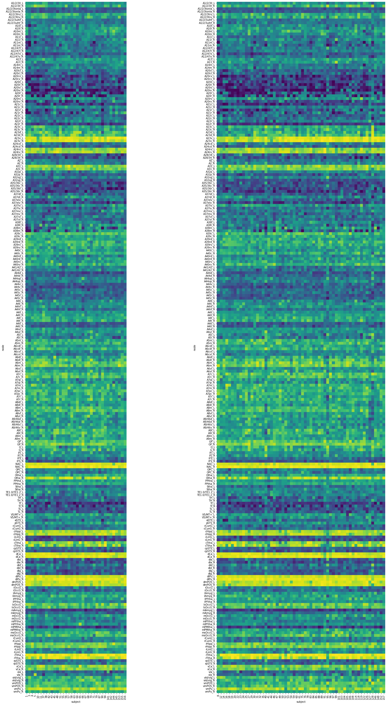
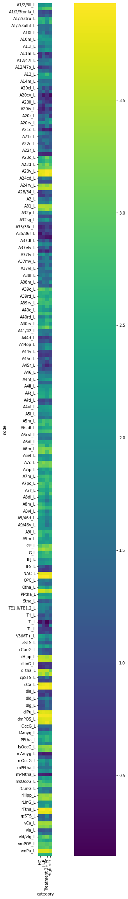

## Results of Cortex+subcortical Brainnetome atlas

[Subject Distibutions](https://htmlpreview.github.io/?https://github.com/pvandyken/prepdwi-recon/blob/new-name-scheme/pages/bn246/subject_distributions.html)

[Nodal Distributions](https://htmlpreview.github.io/?https://github.com/pvandyken/prepdwi-recon/blob/new-name-scheme/pages/bn246/nodal_distributions.html)

[Without outliers](https://htmlpreview.github.io/?https://github.com/pvandyken/prepdwi-recon/blob/new-name-scheme/pages/bn246/attack_analysis_with_outliers.html)

Hubs by subject:

Left = healthy controls, Right = First Episode Psychosis

Hubs by condition:
